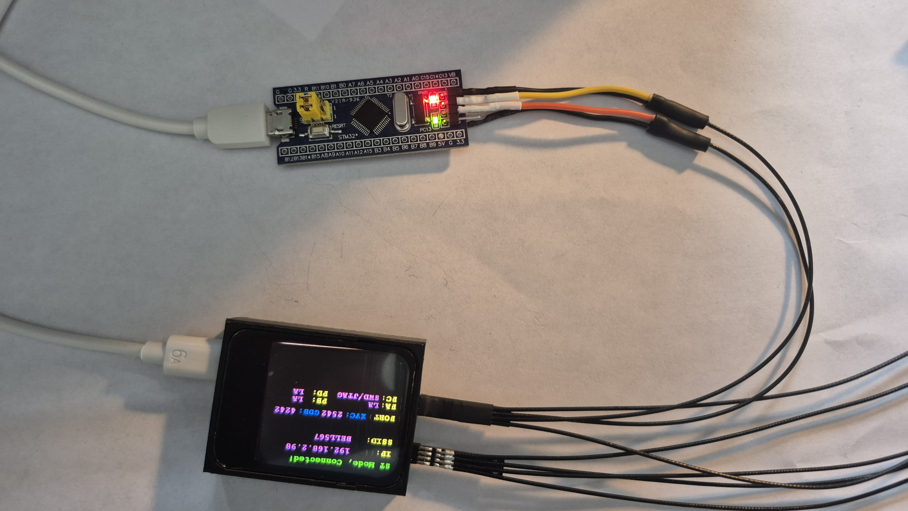
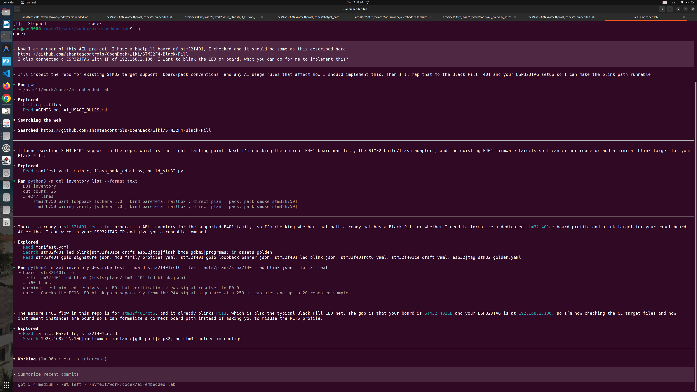
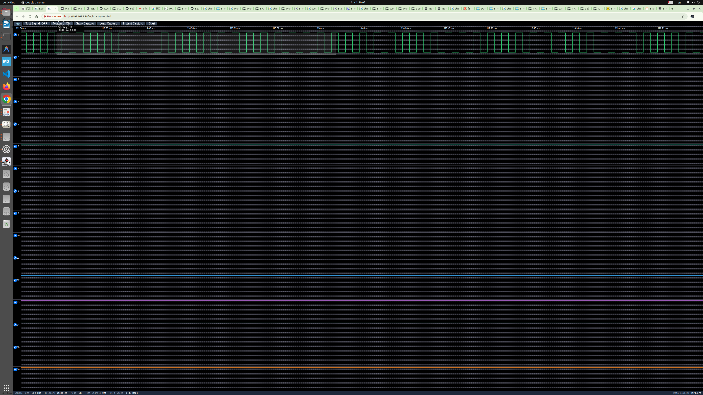
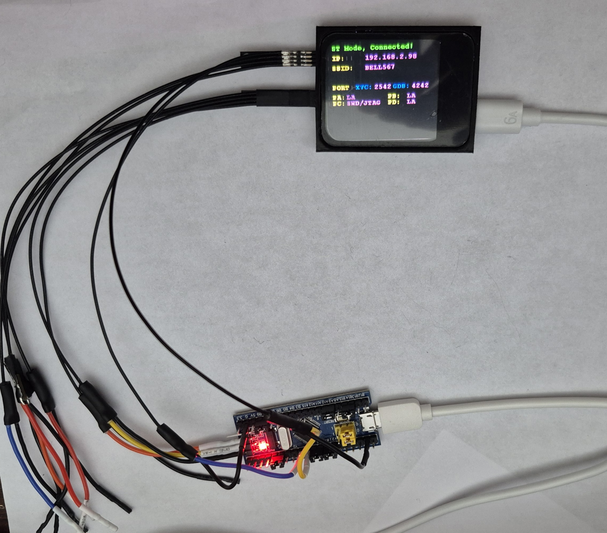
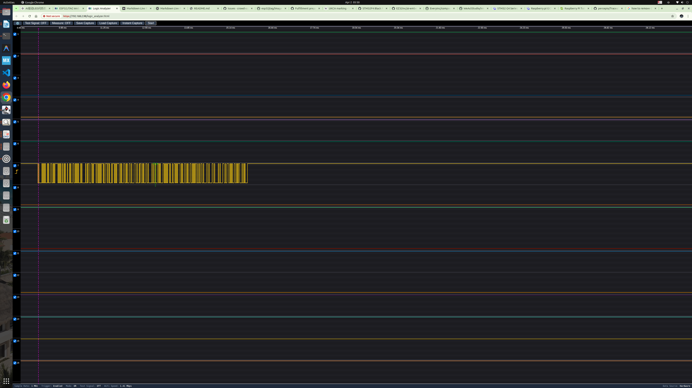
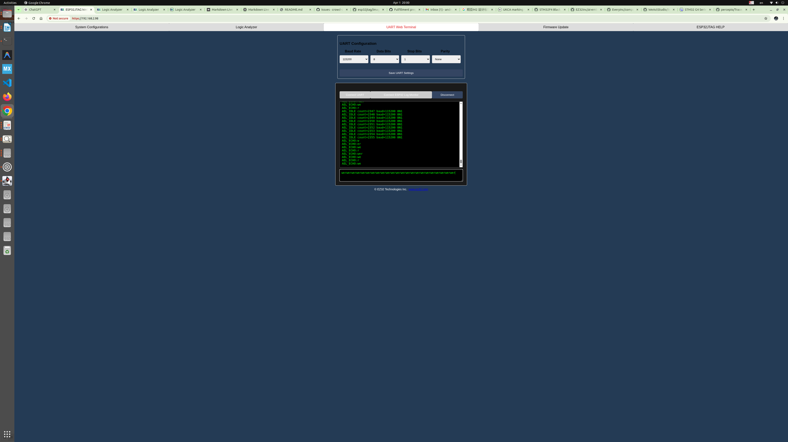

# Tutorial: Getting Started with AI-Driven Embedded Development Using ESP32JTAG

> A hands-on tutorial for ESP32JTAG users, showing how AI, AI Embedded Lab, and ESP32JTAG can generate, build, flash, verify, and iterate on embedded firmware for an STM32 Blue Pill board.

## Introduction

This tutorial demonstrates a workflow that is fundamentally different from traditional embedded development.

In the past, even a simple LED blink program usually meant doing everything manually: writing code, editing it, building it, flashing it, observing the result, and then debugging and fixing issues by hand. The entire process was essentially a human directly driving tools.

Now, with ESP32JTAG, AI Embedded Lab, and an AI tool such as Codex or CloudCode, that workflow can be handed over to AI. The AI can generate code from natural-language instructions, build it, flash the target, verify the outcome, and continue repairing problems until the task is complete.

More importantly, when combined with the Data Capture capability of ESP32JTAG, even the final step of visually checking whether an LED is blinking can be moved from a human observer to machine confirmation. That is what makes this a real AI-driven closed loop.

In this tutorial, **AI-driven** means that the AI is not merely helping with code writing. It is responsible for the full execution loop: **generate → build → flash → verify → repair → verify again**.

---

## What “AI-Driven” Means Here

In this tutorial, **AI-driven** does not mean AI merely acts as a coding assistant that fills in a few lines, answers questions, or offers suggestions.

Here, **AI-driven** means the AI is placed in the execution position. It does not just participate. It drives a full development loop:

- generate code from a natural-language goal,
- build and flash the target,
- run the program,
- observe and verify the outcome,
- diagnose failures,
- repair the implementation and iterate,
- and continue until the task is complete.

In other words, the AI is no longer just an assistant. It is taking over a large part of the execution work that engineers previously had to perform by hand.

---

## Traditional Flow vs. AI-Driven Flow

The difference becomes clearer when the two workflows are placed side by side.

### Traditional embedded workflow

- The engineer sets up the project.
- The engineer writes the code.
- The engineer builds and flashes manually.
- The engineer observes behavior manually.
- The engineer reads documentation, diagnoses issues, and repairs bugs.
- The engineer repeats the loop until the task is complete.

### AI-driven embedded workflow

- The human provides the goal, constraints, and acceptance criteria.
- The AI generates the code.
- The AI builds and flashes the program.
- The AI verifies the result.
- The AI consults documentation, analyzes failures, and repairs the implementation.
- The AI keeps iterating until the task is complete or a subproblem is temporarily set aside.

The real shift is not simply that “AI writes code faster.” The real shift is that the execution loop itself starts moving from “humans directly driving tools” to “humans driving AI, and AI driving the tools and the workflow.”

---

## What You Need

Before getting started, prepare the following:

- An **ESP32JTAG**
- An **STM32F103C6T6 Blue Pill** board
- 3 jumper wires for SWD
- 1 optional jumper wire for machine confirmation, to route a target signal into an ESP32JTAG capture pin
- A **Codex Pro** or **CloudCode Pro** account
- **AI Embedded Lab** downloaded from GitHub

For getting started, a standard Codex Pro or CloudCode Pro account is typically enough. Once the AI tool and AI Embedded Lab are ready, and the hardware is connected, the workflow can begin.

---

## Hardware Setup

The first step is to connect ESP32JTAG to the STM32 Blue Pill through SWD.

The wiring is very simple and uses only three wires:

- **GND → GND**
- **SWCLK → SWCLK**
- **SWDIO → SWDIO**

In this setup, the debugging connection on ESP32JTAG comes from **P3**, also referred to as **Port C**. The two signal wires in the middle connect to the SWD clock and SWD data pins on the STM32 board.

Once these three wires are connected, the target board is ready for AI-driven bring-up.

---

## Software Setup

The software side is also straightforward.

First, you need an AI tool. You can use **Codex** or **CloudCode**. Both are strong options and both work well for this kind of task. You can subscribe through their official websites.

Once the account is ready, download **[AI Embedded Lab](https://github.com/EZ32Inc/ai-embedded-lab)**. It is available from GitHub, distributed under the Apache License, and provided as open-source software.

With both the AI tool and AI Embedded Lab in place, you can start issuing tasks in natural language instead of manually writing the initial project code yourself.

---

## Why ESP32JTAG Matters in This Workflow

In this tutorial, ESP32JTAG is not just a generic programmer or debugger. It matters because it provides the hardware-side capabilities that make a real AI-driven loop possible.

It is important in at least several ways:

- **It can flash and control the target through SWD**, covering the most basic build-and-program path.
- **It can perform Data Capture**, so the system can observe electrical signals directly instead of relying only on a human watching an LED or a terminal window.
- **It can receive and display UART data**, making target-side communication visible through a browser interface.
- **It enables machine confirmation**, which means the workflow can move from “a human thinks the program ran” to “the machine confirmed the program ran from the signal level.”

That is a meaningful difference.

Many tools can flash firmware. Many tools can debug firmware. But not every tool can combine **flashing, interaction, capture, result readback, and machine-level verification** in one workflow.

Once those capabilities are brought together, AI is no longer just writing code. It can drive a much more complete embedded validation loop.

---

## First Task: Make the LED Blink

LED blink has always been the embedded-system equivalent of Hello World. We have all done it before, but this time the process is different: the AI does the work.

You simply tell the AI something like this:

> I have an STM32F103C6T6 Blue Pill board connected through SWD to ESP32JTAG. Please create an LED blink program, generate the code, build it, flash it, and verify that it runs.

For the developer, this is a completely different experience. In the traditional flow, you would set up the project, write the initialization code, configure the clock and GPIO, build, flash, and debug. Here, the only requirement is to describe the goal clearly.

Once the program is generated, built, and flashed successfully, the onboard LED begins blinking.

That result matters because it shows that AI is not merely “helping with some code.” It is executing an actual embedded bring-up workflow on your behalf.

---

## A Simple Change: Double the Blink Rate

The next step is to give the AI an even simpler natural-language instruction:

> I can already see the LED blinking. Good. Now please modify the program so that it blinks twice as fast.

The AI then updates the program, rebuilds it, reflashes the board, and runs the new firmware. Soon after, the LED is blinking at twice the previous rate.

This example is simple, but it illustrates something important.

In a traditional workflow, this would still mean editing code manually, rebuilding, reflashing, and checking the result. In an AI-driven workflow, the entire change can be triggered by a single sentence.

That is the point where the development process starts to feel fundamentally different.

---

## From Human Confirmation to Machine Confirmation

At this stage, development efficiency is already much higher. But if the final step still depends on a human looking at the LED and deciding whether it is blinking, the loop is not yet complete.

This is where the **Data Capture** capability of ESP32JTAG becomes important.

An additional wire can be used to connect **PC13** on the target board to **ESP32JTAG P0.0** (also written as **PA0**, meaning the same thing). Then the AI can be instructed as follows:

> Now I have connected PC13 to ESP32JTAG P0.0 (or PA0, same meaning). Please machine-confirm the visible LED.

For human eyes, a low-frequency blink is easy to see. For machine capture, however, that visible blink may be too slow for convenient and reliable signal acquisition. So the AI may temporarily switch to a higher-frequency electrical probe—perhaps a few kilohertz, tens of kilohertz, or more—to make capture easier and verification more robust.

After the machine check, the result showed that:

- the PC13-to-P0.0 path was machine-confirmed,
- a large number of edges were observed during the capture window,
- the high and low counts were balanced,
- the MCU was indeed driving the PC13 net, and
- ESP32JTAG was indeed observing that same signal at P0.0.

If you are curious, you can capture the and check the waveform using the ESP32JTAG web interface.

Why does this matter?

Because the system is no longer depending on a person to say, “Yes, I can see it blinking.” Instead, the machine has electrically confirmed that the signal is active and behaving as expected.

This is a key step. It turns AI-driven embedded development from automatic code generation into a genuine closed-loop verification workflow.

There is one important caveat: if the verification uses a temporary high-frequency test signal, then it proves strong electrical machine confirmation, not necessarily that a human could visually perceive the LED blinking at that temporary frequency. But for automated verification, that machine-level confirmation is actually the stronger result.

---

## Going Further: A UART Communication Example

LED blink was only the starting point.

ESP32JTAG also provides UART input capability. In other words, it can receive serial output from the target board and expose that data through a browser-based UART interface. That makes it possible to validate not only a visible signal such as an LED, but also a real communication path.

I then gave the AI a new task: design a communication program that would transmit UART data from the target board, allow ESP32JTAG to capture it, and make the result observable from the browser.

It actually completed the task.

The AI did not merely modify an existing demo. It designed the program, wrote the firmware, and produced a complete working implementation in [`main.c`](https://github.com/EZ32Inc/ai-embedded-lab/blob/master/firmware/targets/stm32f103c6_uart_roundtrip/main.c). The entire program is only about 214 lines long—clean, compact, and already practical enough to serve as a real validation test.

What makes this especially striking is that this was not a prebuilt example copied from a template. It was a new validation program created directly from a natural-language objective. The AI was given a goal, and it designed and implemented the firmware needed to achieve that goal.

### What this test does

This test validates two things at the same time:

1. **The target MCU's UART peripheral works correctly**
2. **The ESP32JTAG UART-to-Web bridge works end to end**

So this is not just a firmware test for the STM32F103C6T6. It is also a system-level test of the complete observation path:

**Target UART -> ESP32JTAG UART input -> Web bridge -> AI test runner**

If that full path works, the AI can observe live serial output from the target and use it as part of an automated validation workflow.

### Hardware connections

The wiring is simple:

- **STM32 PA9 (USART1_TX)** -> **ESP32JTAG Port B UART RX**
- **STM32 PA10 (USART1_RX)** <- **ESP32JTAG Port B UART TX**
- **STM32 SWDIO / SWCLK** <-> **ESP32JTAG SWD port**

In this setup, ESP32JTAG plays two roles at once:

- it acts as the **SWD programmer/debugger** used to flash the STM32
- it also acts as the **UART gateway**, forwarding serial data to a browser-accessible interface

Herer is a picture of hardware setup:

.

### How the firmware works

The firmware behaves like a small bare-metal UART echo server.

After power-up, it sends a startup message once:

- `AEL_READY STM32F103C6T6 UART_BRIDGE`

Then, if no input is received, it periodically sends a heartbeat message every 500 ms:

- `AEL_IDLE count=N baud=115200 8N1`

This gives the test system a stable string to look for and confirms that the firmware is alive and the UART path is active.

When the firmware receives a line of text terminated by `\\r` or `\\n`, it sends the line back in this form:

- `AEL_ECHO:<original text>`

It can also flush and echo partial input if the buffer becomes full or if there is a short inactivity gap. In addition, each idle or echo event toggles the PC13 LED, giving a second visible indication that the firmware is running.

Internally, the code uses:

- **8 MHz HSI** as the clock source
- **SysTick** configured for a **1 ms time base**
- **USART1 at 115200 baud, 8N1**

### How the test is validated

The automated test runner performs the following steps:

1. **Flash** the firmware to the STM32 through SWD using ESP32JTAG
2. **Wait briefly** for the firmware to start running
3. **Read UART output** from the ESP32JTAG Web UART bridge for several seconds
4. **Search the captured output** for the expected marker string:
   - `AEL_IDLE count=`

If that string appears, the test passes.

That means the system has verified, in one run, that:

- the STM32 firmware booted successfully
- USART1 is transmitting correctly
- ESP32JTAG received the UART data
- the Web bridge forwarded it correctly
- the AI runner was able to observe and validate the result

We can further checkthe results manualy, if we are curious. 

Here is a picture of captured ESP32JTAG side using its LA(ligic analyzer).

Here is a picture of ESP32JTAG web terminal interfcae

### Why this matters

This example is important because it shows a shift in what AI can do in embedded development.

The AI was not just filling in boilerplate or adapting a known template. It took a natural-language goal, designed a targeted validation program, implemented it, and enabled a complete hardware-visible test path.

That is a meaningful step beyond code completion. It shows AI beginning to participate in **design, implementation, and validation** of embedded systems toward a stated engineering objective.

---

## From Small Examples to Golden Test Suite

Even then, everything above is still just a small beginning.

Before this work, a great deal of experience and test planning had already been built up around multiple STM32 and other MCU boards, including:

- STM32F103, STM32F401, STM32F407, STM32F411, STM32G431, STM32U585, STM32H750
- RP2030, RP2350 
- ESP32 series: ESP32S3, ESP32C3, ESP32C5, ESP32C6, ESP32-WROOM32D

With that background, the AI could be given a much stronger instruction:

> I know you have something called a Golden Test Suite, like the one for STM32F407VET6. It can test many features of that MCU. Please create a similar test suite for this STM32F103C6T6. Give me your plan: how you will do it, what kinds of tests you can create and run, and what connections are needed for this test suite.

And once the wiring was prepared, it could be pushed further:

> Now everything is connected as you desired. Please go on and finish all of them without asking my permission. Follow these rules: each test has a maximum of 15 minutes. If the test is not completed within 15 minutes, stop and check ST’s official documentation and reference code for the same MCU, or for an official example on a similar MCU that matches or closely resembles the test you are trying to run. You should also search online for examples implementing the same function on the same MCU, compare the code, and use those differences to locate the problem. Then restart the repair effort. After that, spend no more than 10 additional minutes trying to fix it. If it still cannot be fixed within that time, set that test aside for now and move on to the next one.

After several more rounds of interaction and about four hours of work, the Golden Test Suite for STM32F103C6T6 was completed and fully passed.

The resulting list showed that, aside from a few features such as I2C that depended on additional external conditions or hardware constraints, most of the important functionality of the MCU had been covered and validated.

At that point, this was no longer just an LED blink demo. It had become a workflow capable of scaling toward system-level validation.

### The Test List in the Suite

The final STM32F103C6T6 Golden Test Suite was organized in stages.

**Stage 0** established the board-life baseline:
- PC13 LED blink
- minimal runtime/mailbox check

**Stage 1** validated core internal MCU functions:
- timer interrupts
- SysTick
- internal temperature sensor
- system identity registers
- reset cause flags
- sleep/wake behavior
- VREFINT ADC readback
- independent watchdog

Before running richer peripheral tests, the suite also included **connectivity probes** to verify that the required external jumpers were really present:
- PB0 <-> PB1
- PB8 <-> PB9
- PA0 <-> PA1
- PB15 <-> PB14

**Stage 2** then validated external loopback and peripheral behavior:
- GPIO loopback
- EXTI trigger detection
- ADC loopback
- timer capture
- PWM capture
- hardware PWM generation/measurement
- SPI1 loopback
- UART loopback
- multi-byte UART
- UART with DMA

This staged structure was important. It let the AI begin with the simplest proofs, confirm the test bench wiring, and then move into more advanced peripheral validation only after the lower layers were known to be correct.

---

## What the AI Is Doing in This Workflow

We ahve a detailed [a doc](docs/reports/ael_esp32jtag_stm32f103c6t6_dev_whole_log-2026-04-01.txt) that record all the process of this ,from teh start of detecting the connected target baord and stm32f103c6t6 MCU, to the completion of golden suite generation. [This doc](docs/reports/stm32f103c6t6_golden_suite_closeout_2026-04-01.md) has a summarry of this golden suite generation.

So what is the AI actually doing during this process?

First, it generates the firmware and test logic required for the task. For example, if it is asked to create a UART TX/RX test, it writes the code, compiles it, flashes it onto the target MCU, and then checks whether the received data matches what was transmitted.

On the MCU side, the firmware reports its result through a mailbox. On the PC side, AEL reads that mailbox back over the SWD interface. This gives the system a direct way to verify whether the test has passed.

If the result is wrong, the AI does not simply stop and wait for human intervention. It examines the failure, revises the code, and runs the full cycle again: compile, flash, check, and evaluate. That is why this process can be described as fully AI-driven. My own role is mostly to provide high-level goals, such as: **“Finish this UART loopback test.”**

Sometimes I also give it an execution rule:

> Work on this test for 15 minutes. If it still does not pass, stop and consult ST’s official documentation, reference code, and example projects for the same MCU. You may also search online for examples targeting the same function on the same MCU, compare them with your implementation, and use the differences to locate the problem. Then continue for another 10 minutes. If it still cannot be fixed, put that test aside and move on to the next one.

I call this the **15-minute tick, 10-minute block** rule.

In many cases, the AI can complete a test in a single pass. But some failures require several rounds of iteration. There are real cases where [a test took three full rounds](docs/reports/ael_esp32jtag_stm32f103c6t6_dev_whole_log-2026-04-01.txt) of **code -> flash -> check -> repair** before the issue was finally resolved and the test passed.

That is what makes this workflow different from ordinary code generation. The AI is not just writing code once. It is participating in a real engineering loop: generating firmware, running it on hardware, observing the result, diagnosing the failure, correcting the implementation, and trying again.

---

## Surprising Behaviors in AI-Driven Development

When AI is placed in the role of development executor, the results can be very different—and sometimes genuinely surprising. This is not the same thing as using AI in the old “assistant” model.

Here are three representative examples.

### 1. AI can design temporary experiments to locate problems

While generating tests for STM32H750, we once ran into an SPI loopback problem. The idea of the test was simple: connect SPI output back into SPI input, transmit data, receive it again, and verify correct behavior.

During execution, the AI generated the code, ran the test, and reported failure: it could not receive the expected data.

The surprising part was that it did not stop and wait for a human to intervene. Instead, it kept going and designed a temporary experiment to isolate the problem.

Because it knew that the SPI MISO and MOSI pins could also be configured as GPIO, it temporarily set one line as a GPIO output and the other as a GPIO input, then checked whether the input could directly observe the output transitions. In other words, it created a connectivity experiment for diagnosis.

After running that temporary test, it concluded that the connectivity was faulty and told me to inspect the hardware. I checked the board and found that the issue really was physical: related soldering and connector work had not been completed properly. After resoldering, the SPI experiment passed.

That was striking, because it showed that the AI was no longer just “writing code.” When the main path failed, it created a new validation method to locate the issue.

### 2. AI can invent a new closed-loop mechanism: Mailbox

Another example involved ST-Link.

We had already confirmed that a common ST-Link could be used to flash firmware. But then a question came up: without a capability like ESP32JTAG Data Capture, how do you close the loop? If a program is flashed—for example, an LED blink program—how do you know whether it actually completed the intended task?

At one point, I almost asked the AI rhetorically: “It seems like we cannot detect the final output. We can write the program, but we do not really know the result. Is that right?”

Unexpectedly, the AI responded that **yes, the result can still be recovered**.

It proposed a mechanism and gave it a very fitting name: **Mailbox**.

The idea was simple and elegant. After completing its task—for example, after checking whether an SPI input/output behavior was correct—the target program writes a result into an agreed RAM region. Then ST-Link reads that RAM location back over SWD. That way, the host can learn whether the task finished and whether the outcome was correct or not.

That is the Mailbox mechanism.

Its significance is substantial. It shows that with nothing more than SWD and the basic three wires, it is possible not only to flash firmware, but also to run code, collect a result, and form a closed loop.

It was a very good mechanism—and the AI proposed it and named it in the course of solving a practical problem.

### 3. AI can optimize a wiring-identification method on its own

The third example also involved connectivity.

At one point, we needed to connect four ESP32JTAG lines to four GPIOs on a target system. This is exactly the kind of situation where humans make common mistakes: what should have been P0.0, P0.1, P0.2, P0.3 connected to GPIO0, GPIO1, GPIO2, GPIO3 may instead get wired as GPIO3, GPIO2, GPIO1, GPIO0—or worse.

As a result, the system kept reporting errors, and it was clear that the wiring relationship itself was wrong.

I suggested an approach to the AI: it could write four separate programs. In the first, only the first line toggles; in the second, only the second line toggles; and so on. By observing which physical line changed each time, it could recover the true wiring map.

The AI replied: **there is no need for four programs—one program is enough.**

Its method was better.

It drove the first line at 1 kHz, the second at 2 kHz, the third at 4 kHz, and the fourth at 8 kHz, all in the same program. Then, after capture, it only needed to measure the frequency on each observed line to determine which physical connection went where.

That was simpler and more efficient than my original suggestion.

This example again showed that the AI was not just mechanically executing a human proposal. Once it understood the objective, it could produce a better method on its own.

### 4. AI Knows How to Use the Tool

ESP32JTAG may be among the first debugging and logic-analysis tools that AI can use directly.

That immediately raises an interesting question: how does the AI know how to use it? Does it need to be specially trained? Do we need to feed it documentation and tutorials?

Surprisingly, not necessarily.

In practice, I found that simply giving the AI access to the **source code of ESP32JTAG** was enough. From the code, it could understand how the tool works and how to operate it: how to flash a target, how to set breakpoints, how to single-step, how to configure the logic analyzer, how to trigger captures, and how to read back and interpret the captured data.

I did not need to write a long manual for the AI or explicitly teach it every operation. The implementation itself already described the tool well enough.

This reinforces an old truth in a new way: **code is the best documentation**. It is the most faithful description of what a system really does, because it reflects the actual behavior rather than an approximation written afterward.

And this may change how tools are built and understood. For years, software tools were designed mainly for human users, and that meant their knowledge had to be translated into manuals, tutorials, and user interfaces. But if AI can learn directly from source code, then the codebase itself becomes the most direct and authoritative way to communicate how a tool should be used.

---

## What Shocked Me Most in These Experiments

After going through this round of experiments, I came away with several very strong conclusions.

First, **AI-driven embedded development has now become genuinely practical—not just as a concept, but as a real closed-loop workflow running on actual hardware**. Maybe two or three months ago, model capability was not yet stable enough at this level. But now it has crossed an important threshold. This is exactly why I think the point mentioned in **[Lenny Rachitsky’s podcast](https://simonwillison.net/2026/Apr/2/lennys-podcast/)** is so relevant here. In that discussion, the recent model progress was described as an **[inflection point](https://simonwillison.net/2026/Apr/2/lennys-podcast/#the-november-inflection-point)**: in the past, the code would mostly work, but you still had to watch it very carefully; now, much more often, once you state the goal clearly, it can actually do what you asked it to do. On the surface, this may look like only an incremental improvement, but once that threshold is crossed, the whole experience changes. In embedded development, this means that from code generation, to build, flashing, verification, bug localization, and bug fixing, AI can now independently carry out most of the concrete work in the full chain. As a result, engineers can be freed from a large amount of repetitive coding, repeated downloading, manual debugging, visual checking, and hand-driven troubleshooting, and instead spend more of their energy on higher-level system goals, test strategy, validation coverage, and architecture design.

Second, **its efficiency is extremely high, the iteration speed is extremely fast, and the quality of the generated code has clearly reached a new level**. In these experiments, within only a few hours, the AI went from the most basic LED blink example, to machine-confirmed verification, and then further to a structured Golden Test Suite. The speed of that coverage expansion is quite remarkable. More importantly, it is not only fast at generating code; in many cases the code quality is also high, and it often gets the main direction right on the first try. Even when it does not succeed in one pass, it does not stop there waiting for a human to take over the way a traditional code-completion tool would. Instead, it moves into the next round by checking the error result, inspecting what actually happened, comparing against official documentation and examples, analyzing the differences, modifying the implementation, compiling again, flashing again, and verifying again. Its debugging style is actually already very close to that of a human engineer. It does not always rely on single-stepping and breakpoint analysis, although it can use those tools too. Most of the time, it behaves more like a real engineer: first capture the failure symptom and returned result, focus on the key problem, re-examine the implementation, repair it using documentation and examples, and keep moving forward. The earlier example of simply doubling the LED blink frequency was actually a very small case, but it was already enough to show the speed of this workflow. And beyond that, to complete so many test generations, code implementations, and problem repairs within only a few hours would usually be very difficult even for a highly experienced engineer doing everything manually while also checking documentation, comparing official examples, and searching online for reference code. Even if it could be finished within a week, it would still be a substantial challenge.

Third, **this shows that AI is no longer just a tool that “writes some code”; it is entering a true execution loop and beginning to take responsibility for problem-solving**. This process was not bug-free, and it was certainly not smooth all the way through. Problems still appeared, peripherals still failed, and code still broke. But the key point is that AI did not stop and wait for human takeover when that happened. It went to ST’s official documentation, reference code, and demos on its own. It also searched for working examples involving the same MCU, the same function, or very similar scenarios, compared those implementations against its current code, identified likely causes from the differences, repaired the implementation, and then continued compiling, flashing, and verifying. In other words, it was not merely generating code; it was taking on the responsibility of a real engineering loop: **find the problem, analyze the cause, repair the implementation, and verify again**. That matters, because it means the role of AI is beginning to shift from a code-completion tool toward a real **execution partner**.

Fourth, **what this reflects is not just a point improvement in efficiency, but a change in the development paradigm itself**. Traditional software and embedded development have long depended heavily on IDEs, breakpoints, single-stepping, register inspection, manual judgment, and manual patching. The default model has always been that the human engineer personally performs every detailed action. But now a new model is emerging: instead of doing every detail by hand, the human defines the goals, constraints, and strategy, while the AI takes on a large amount of the concrete execution work, including code generation, compilation, flashing, verification, debugging, and repair. Then the human and the AI work together to complete the overall system development process. In that sense, the role of the engineer is being lifted upward. In the past, a great deal of time was spent on repetitive low-level actions such as creating projects, changing registers, recompiling and reflashing again and again, watching symptoms, manually confirming behavior, and patching bugs one by one. Now, more and more of that work can be delegated to AI. Engineers should increasingly focus on defining system goals, designing validation coverage, planning the verification path, making architectural decisions, judging boundary conditions, and making directional decisions at key points. The meaning of this change is not merely that “code can be written faster”; it is that the engineer is beginning to move from executor toward director, designer, and judge.

Fifth, **the tools and instruments themselves are also beginning to change, and ESP32JTAG is a very representative example**. It may be one of the first embedded debugging and logic-analysis instruments that can be used not only by humans, but directly by AI as well. A natural question is: how does AI learn to use such a tool? Does it need special training? Do we need to write detailed manuals, tutorials, and operating instructions for it? The answer from these experiments was very direct: **no**. As long as you give the AI the source code of ESP32JTAG, it can learn how to use the tool. From the code, it can understand how to interact with the device through its Web interface, how to flash, how to set breakpoints, how to single-step, how to configure the logic analyzer, how to set the sampling rate, how to trigger a capture, and how to read and judge the captured results. In other words, for AI, **the source code itself is the most accurate, most complete, and most authoritative documentation**. This reinforces an old truth: **code is the best documentation**. But now that sentence has taken on a new meaning. In the past, people said “code is the best documentation” mainly for human engineers. Now it is also becoming the most direct way for AI to learn how to use tools, understand system behavior, and even continue improving the tools themselves. Going one step further, instruments of this kind may increasingly be designed in the future not only for human users, but also for AI users. AI does not really need large amounts of traditional human-written documentation. On the contrary, that documentation can itself be generated by AI from the code, often at very high quality and with very broad coverage. As a result, the design priorities of future instruments may shift more toward better network interfaces, faster storage and data paths, more programmable control interfaces, and architectures that allow AI to connect directly, reason directly, and operate directly. And because the instrument itself is also part of this evolving loop, AI may not only be able to use it; it may also be able to suggest improvements, modify its code, and even participate in redefining the form of the next generation of instruments.

Taken together, the deepest impression these experiments left on me is this: **in embedded development, AI is beginning to move from being “an assistant that helps write code” to being an engineering partner that takes part in the execution loop itself**. It can expand coverage quickly, generate high-quality code, repair itself after failure, learn to use tools and instruments directly, and may even drive the evolution of those tools in return. For embedded development, this means not only higher efficiency, but a real change in the division of work and in the development paradigm itself.

---

## Why This Matters

For embedded development, the significance of this change is not merely that code can be written faster.

What matters even more is that the role of the engineer moves upward.

In the old model, much of the work consisted of repetitive low-level tasks: setting up projects, changing registers, rebuilding and reflashing, watching symptoms, confirming behavior manually, and patching bugs by hand. More and more of that work can now be delegated to AI.

That allows engineers to spend more of their time on higher-level work:

- defining system goals,
- designing test coverage,
- planning validation strategy,
- making architectural decisions, and
- judging results and steering direction.

That is why AI is no longer just an assistant in embedded development. It is beginning to act as a true execution partner.

---

## Conclusion

If you look only at an LED blink example, this may still seem like an interesting demonstration.

But once the workflow expands to machine-confirmed verification, UART communication, Golden Test Suites, and automatic recovery from failure, it becomes clear that this is no longer just AI helping write some code.

It is beginning to look like a real shift in how embedded development itself is done.

The model is moving from humans directly driving IDEs and debugging tools at every step to humans defining goals, constraints, and test intent while AI executes the loop and acts as an intelligent engineering partner.

ESP32JTAG provides exactly the kind of hardware-side capability needed to make that practical: flashing, interaction, data capture, and machine-readable verification.

For me, that is the core message of this tutorial:

**AI-driven embedded development is no longer just an idea. It is becoming a practical engineering workflow on real hardware.**

